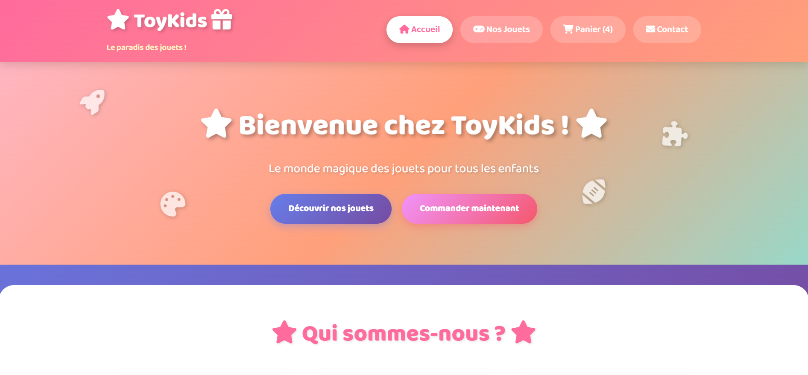

# 🎁 ToyKids - Online Toy Store

A complete e-commerce website for selling toys developed with HTML5, CSS3, JavaScript, PHP and MySQL.

## 🖼️ Preview



## 📋 Description

ToyKids is an e-commerce platform allowing customers to browse, select and order toys online. The site includes a cookie-based shopping cart system (no authentication required) and a complete admin panel to manage orders, products, customers and messages.

## ✨ Features

### 🛍️ Customer Area
- **Home Page**: Store presentation with popular toys
- **Toy Catalog**: Browse by categories with filters (age, price, category)
- **Shopping Cart**: Cookie-based cart system (30 days)
  - Add/remove items
  - Modify quantities
  - Automatic total calculation
- **Order**: Order form to validate purchases
- **Contact**: Contact form for questions

### 👨‍💼 Admin Panel
- **Secure Authentication**: Admin login with hashed passwords (bcrypt)
- **Dashboard**: Overview with statistics
- **Order Management**: Full CRUD with stock management
- **Toy Management**: Add, edit, delete products
- **Customer Management**: View customer list
- **Message Management**: Receive and process contact messages

## 🛠️ Technologies Used

- **Frontend**:
  - HTML5
  - CSS3 (modern design with gradients)
  - JavaScript ES6+
  - Font Awesome 6.4.0 (professional icons)
  - Google Fonts (Baloo 2, Inter)

- **Backend**:
  - PHP 7+
  - PDO for MySQL queries
  - PHP Sessions (administration)
  - Cookies (customer cart)

- **Database**:
  - MySQL 5.7+
  - 6 tables with relationships (foreign keys)

## 📦 Installation

### Prerequisites
- XAMPP (or WAMP/LAMP) with PHP 7+ and MySQL
- Modern web browser

### Installation Steps

1. **Clone the repository**
   ```bash
   git clone https://github.com/MahdiDbh/ToyKids-Magasin.git
   cd ToyKids-Magasin
   ```

2. **Move the files**
   - Copy content to `C:\xampp\htdocs\magasin\` (Windows)
   - Or `/opt/lampp/htdocs/magasin/` (Linux)

3. **Configure the database**
   - Start XAMPP and launch Apache + MySQL
   - Open phpMyAdmin: `http://localhost/phpmyadmin`
   - Create a new database: `toykids_shop`
   - Import SQL files in order:
     1. `database.sql` (table structure and data)
     2. `admin_table.sql` (admin table)

4. **Configure the connection**
   - Open `config.php`
   - Check connection parameters:
     ```php
     $host = 'localhost';
     $dbname = 'toykids_shop';
     $username = 'root';
     $password = ''; // Empty by default on XAMPP
     ```

5. **Access the site**
   - Public site: `http://localhost/magasin/`
   - Admin panel: `http://localhost/magasin/admin-login.php`

## 🔐 Admin Credentials

- **Username**: `admin`
- **Password**: `admin123`

## 📊 Database Structure

### Main Tables

1. **jouets**: Catalog products
   - `id_jouet`, `nom_jouet`, `description`, `prix`, `stock`, `age_recommande`, `categorie`

2. **clients**: Customer information
   - `id_client`, `nom`, `prenom`, `email`, `telephone`, `adresse`

3. **commandes**: Orders placed
   - `id_commande`, `id_client`, `date_commande`, `montant_total`, `statut`

4. **details_commande**: Order item details
   - `id_detail`, `id_commande`, `id_jouet`, `quantite`, `prix_unitaire`

5. **contacts**: Contact messages
   - `id_contact`, `nom`, `email`, `sujet`, `message`, `date_envoi`, `statut`

6. **admins**: Admin accounts
   - `id_admin`, `username`, `password_hash`, `email`, `created_at`

## 📁 Project Structure

```
magasin/
├── index.php              # Home page
├── jouets.php             # Toy catalog
├── panier.php             # Shopping cart
├── commande.php           # Order page
├── contact.php            # Contact form
├── config.php             # DB configuration
├── style.css              # Main styles
├── script.js              # JavaScript scripts
├── admin-login.php        # Admin login
├── admin-style.css        # Admin styles
├── dashboard.php          # Admin dashboard
├── commandes.php          # Order management
├── jouets-admin.php       # Toy management
├── clients.php            # Customer management
├── messages.php           # Message management
├── ajouter-commande.php   # Add order
├── ajouter-jouet.php      # Add toy
├── modifier-jouet.php     # Edit toy
├── database.sql           # DB structure
└── admin_table.sql        # Admin table
```

## 🎨 Toy Categories

- 🤖 Electronics
- 👧 Dolls
- 🧩 Educational
- 🚗 Vehicles
- 🧱 Construction
- 🐾 Plush toys
- ⚽ Sports
- 🎨 Creative
- 🏃 Outdoor
- 🎲 Board games

## 🔒 Security

- Hashed passwords with `password_hash()` (bcrypt)
- Prepared statements (PDO) to prevent SQL injection
- XSS protection with `htmlspecialchars()`
- Secure sessions for administration
- Server-side data validation

## 📱 Responsive Design

The site is fully responsive and adapts to different screen sizes:
- Desktop (> 1200px)
- Tablet (768px - 1200px)
- Mobile (< 768px)

## 🚀 Advanced Features

- **Stock Management**: Automatic update during orders
- **Advanced Filters**: Search by category, age, price
- **Statistics**: Number of products, total stock, revenue
- **CSS Animations**: Smooth transitions and visual effects
- **Professional Icons**: Font Awesome 6.4.0

## 📝 Author

**Mahdi Debbah**
- Email: mahdi.debbah@outlok.com
- GitHub: [@MahdiDbh](https://github.com/MahdiDbh)

## 📄 License

This project is an academic project developed for educational purposes.

## 🤝 Contribution

Contributions are welcome! Feel free to:
1. Fork the project
2. Create a branch (`git checkout -b feature/improvement`)
3. Commit your changes (`git commit -m 'Add feature'`)
4. Push to the branch (`git push origin feature/improvement`)
5. Open a Pull Request

## 📞 Support

For any questions or issues:
- Open an issue on GitHub
- Send an email: mahdi.debbah@outlok.com

---

**⭐ Don't forget to star this project if you found it useful!**
